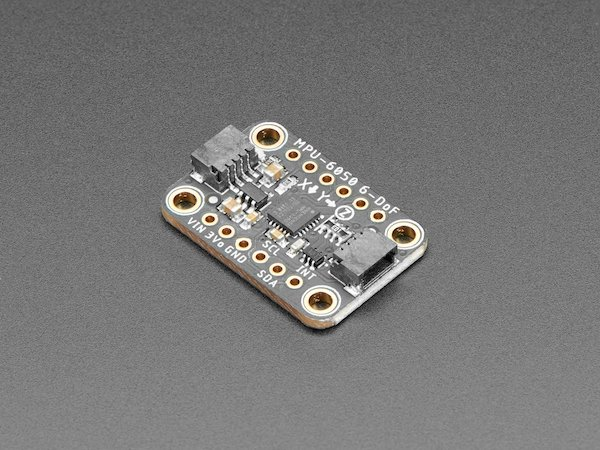
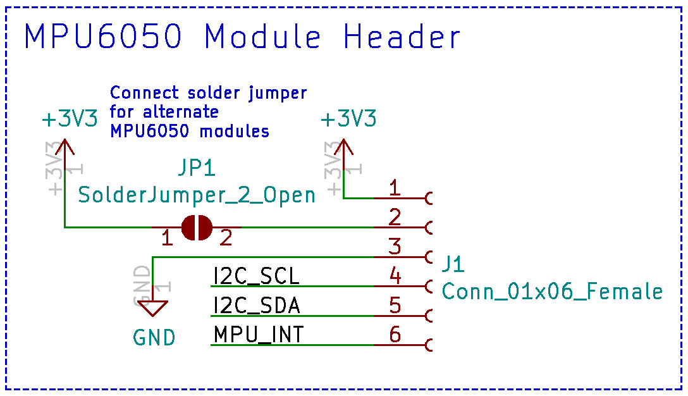
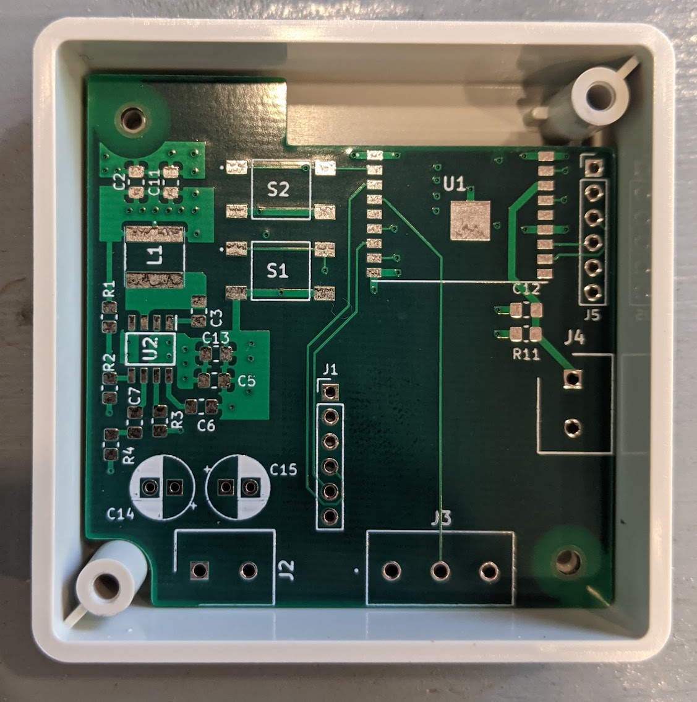
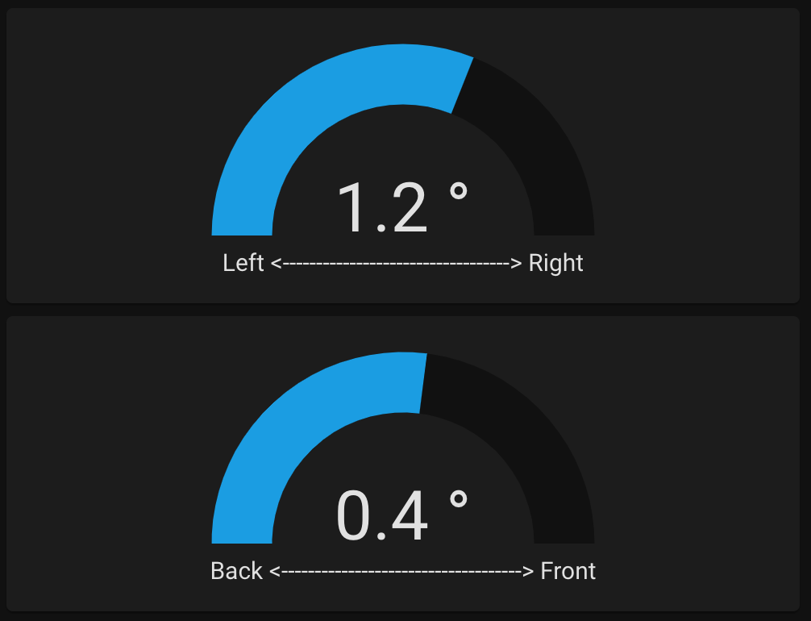
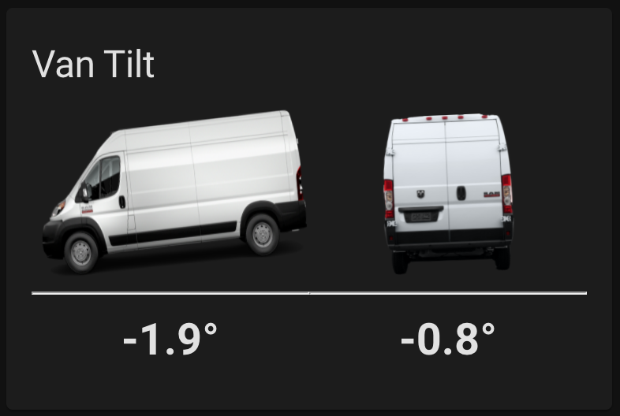

The next sensor I thought would be useful was a level sensor to see how flat the van is. When parking for the night, it's always more comfortable if the van is level — I'd always find myself inching forward and backward asking "is it better now?". The easy solution would be a bubble level, but I thought it would be much more interesting to incorporate it into Home Assistant.

## What you'll need

- **[MPU6050 Accelerometer](https://www.adafruit.com/product/3886)** — Measures gravity on 3 axes to determine which way is down. Also has a gyroscope (not needed for this project).
- **ESP32 or ESP8266** — To send the data to the Raspberry Pi over WiFi, or you can interface the MPU6050 directly with the Pi.

## The hardware

Any 2 or 3-axis accelerometer works for this, but the MPU6050 is widely available with lots of breakout boards:



The MPU6050 communicates via I2C. I wanted to mount it under my bed platform, which was too far from the Pi, so I used an ESP8266 to communicate with the MPU6050 and send data over WiFi.

If you built the [water level sensor PCB](/monitor_water_level/), there's a 6-pin I2C header on that board (J1) added specifically for the MPU6050. In its default state it works with the Adafruit MPU6050 module. Closing the JP1 solder jumper also accommodates cheaper MPU6050 modules from Amazon.



KiCad files: [ESP8266 PCB KiCad Files](https://github.com/CF209/kicad/tree/main/ESP8266_Water_Sensor)



## Step 1 — Configure ESPHome

ESPHome has built-in support for the MPU6050:

[ESPHome MPU6050 Documentation](https://esphome.io/components/sensor/mpu6050.html)

Open the ESPHome dashboard and create a new device (Generic ESP8266). Add the following to the config:

```yaml
i2c:
  sda: 2
  scl: 14

sensor:
  - platform: mpu6050
    address: 0x68
    update_interval: 200ms
    accel_x:
      name: "MPU6050 Accel X"
    accel_y:
      name: "MPU6050 Accel Y"
```

Adjust the I2C pin numbers if your setup is different. The default I2C address for the MPU6050 is `0x68`. I set an update interval of 200ms and only read the X and Y acceleration axes — these are enough to calculate left-to-right and front-to-back tilt.

## Step 2 — Convert to degrees in Home Assistant

With the ESPHome integration, the new sensor is automatically detected. To convert raw acceleration values to degrees, use this equation:

```
tilt (degrees) = arcsin(acceleration / gravity) × 180 / π
```

Add template sensors to `configuration.yaml`:

```yaml
  - platform: template
    sensors:
      x_angle:
        friendly_name: "X Angle"
        unit_of_measurement: "°"
        value_template: '{{ ((asin((states("sensor.mpu6050_accel_x") | float) / 9.81) * 180 / pi) - 2.8) * -1 }}'
      y_angle:
        friendly_name: "Y Angle"
        unit_of_measurement: "°"
        value_template: '{{ ((asin((states("sensor.mpu6050_accel_y") | float) / 9.81) * 180 / pi) + 0.3) * -1 }}'
```

The offset values (2.8 and 0.3) came from calibrating with a phone level app at multiple inclines. The `-1` multiplier inverts the readings to match my preferred orientation.

## Step 3 — Add a low-pass filter

There was quite a bit of sensor noise, so I added a low-pass filter:

```yaml
  - platform: filter
    name: "Filtered X Angle"
    entity_id: sensor.x_angle
    filters:
      - filter: lowpass
        time_constant: 5
        precision: 1
  - platform: filter
    name: "Filtered Y Angle"
    entity_id: sensor.y_angle
    filters:
      - filter: lowpass
        time_constant: 5
        precision: 1
```

The end result is a sensor showing the van's tilt, making it much easier to find a level parking spot:



## Update: Custom Lovelace card

I wasn't happy with how the default sensors looked, so I made a custom Lovelace card that shows the tilt visually with a van graphic that tilts in real time:



The code for the card: [Van Tilt Sensor Custom Card](https://github.com/CF209/van-tilt-sensor-custom-card)

To install:
1. Create a new folder at `homeassistant/www/van-tilt-card/` and download the files there.
2. In Home Assistant go to **Configuration → Lovelace Dashboards → Resources** and click **Add Resource**.
3. Enter `/local/van-tilt-card/van-tilt-card.js` for the URL and **JavaScript Module** for the type.
4. Add the card to your dashboard manually with:

```yaml
type: 'custom:van-tilt-card'
entity_x: sensor.filtered_x_angle
entity_y: sensor.filtered_y_angle
```
