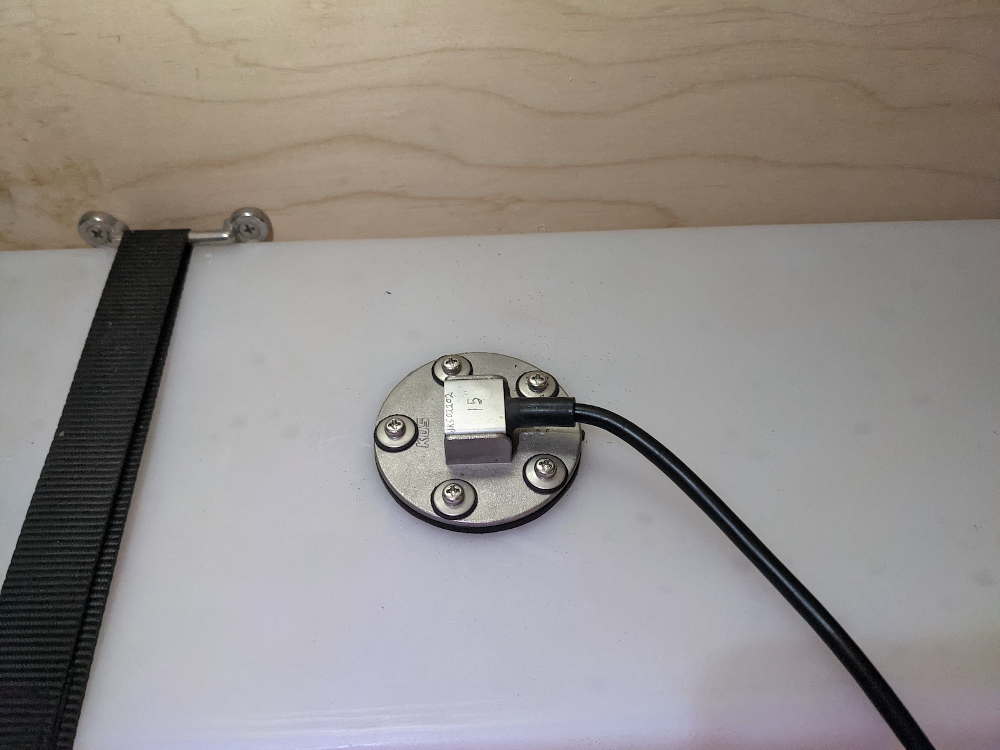
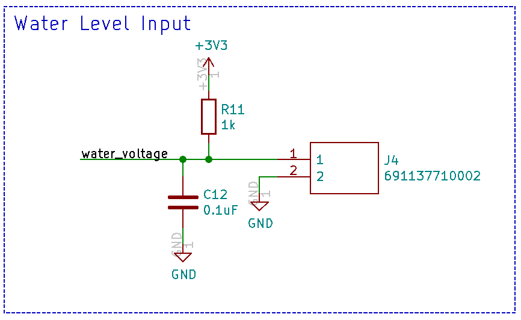
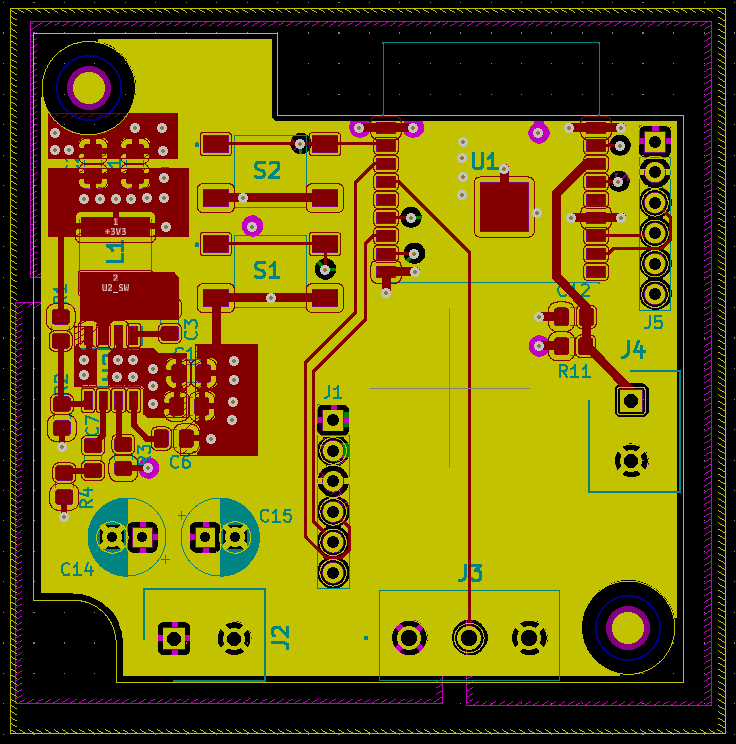
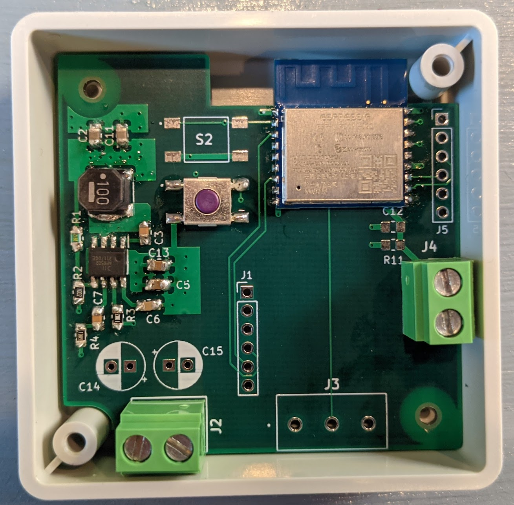
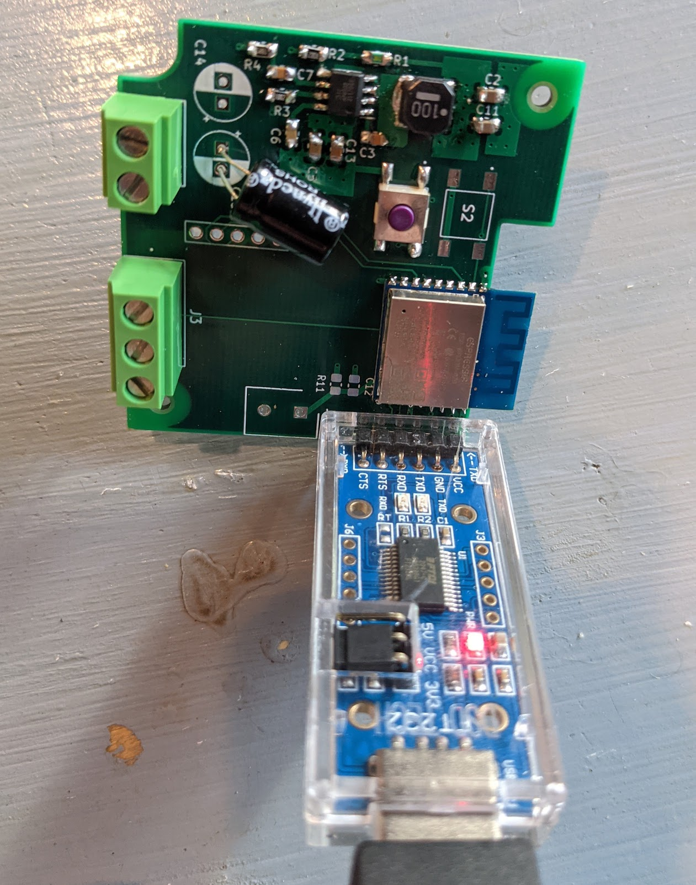
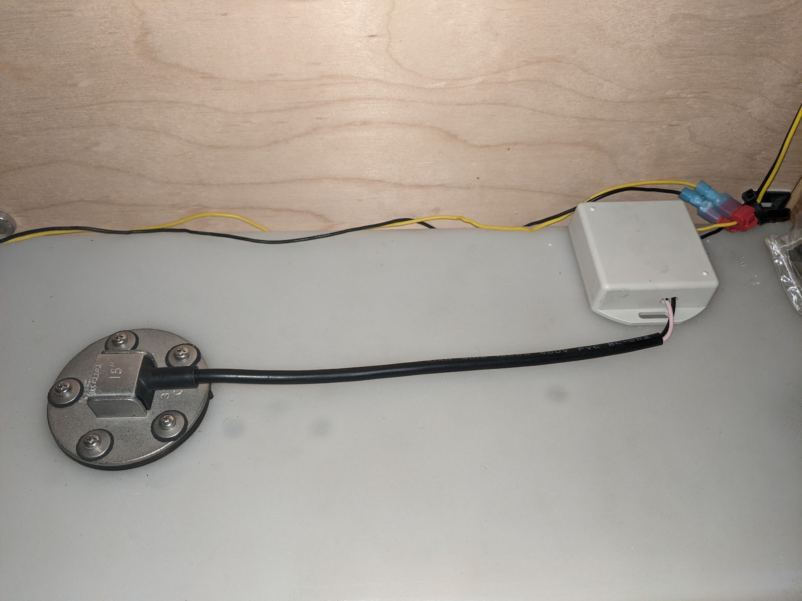
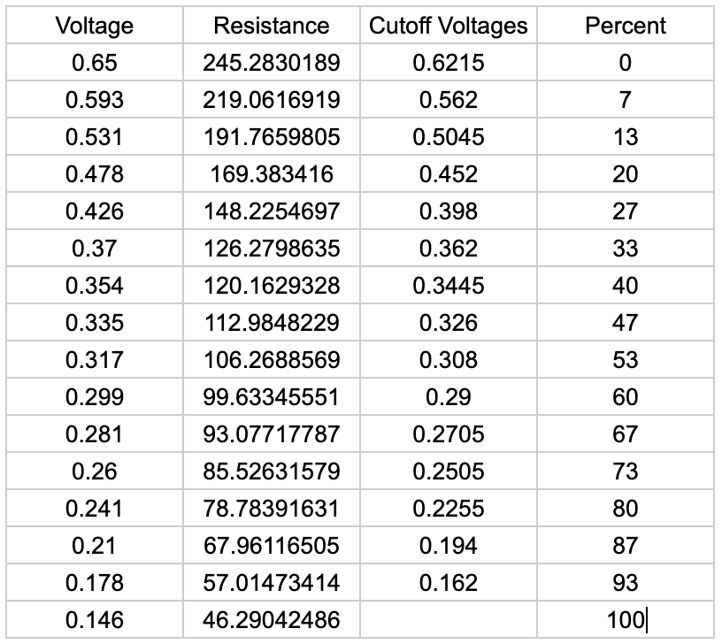
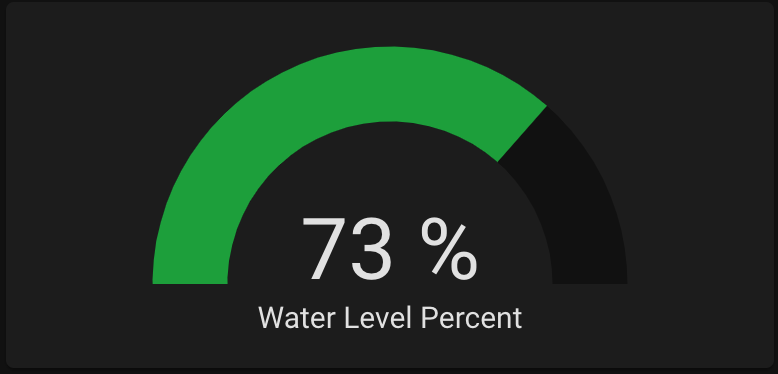

The next thing I wanted to monitor was the amount of water in my freshwater tank. Previously I'd have to peek through a little door on the side of my cabinet and make a rough estimate — being able to quickly pull out my phone and check was a huge improvement.

## What you'll need

- **[20-Gallon Water Tank](https://amzn.to/4tMoApi)** — Any water tank with a flat top should work. Shorter tanks may have less accurate results.
- **[KUS Water Level Sensor](https://amzn.to/4823c7e)** — I used the 15" sensor. For plastic tanks, use a sensor 1" shorter than the tank height.
- **[Water Sensor Flange](https://kus-usa.com/product/fls-u/)** — Needed to mount the sensor to the tank.
- **[40mm Hole Saw](https://amzn.to/4dOjlRs)** — To cut a hole in the top of the water tank.
- **ADC Electronics** — I designed a custom PCB using an ESP8266. See below for details.

## Step 1 — Install the sensor

:::caution
You'll be cutting a hole in the top of the water tank. Be careful or you could ruin it.
:::

Start by draining the water tank — drilling leaves plastic residue, so it's easier to clean up when empty.

Choose a mounting location near the center of the tank top (the more centered, the less readings are affected by parking on a hill). Drill the 40mm hole, then drill the 5 screw holes around it using the flange or sensor as a template. Vacuum out any plastic debris.

Install the sensor using the flange — the flange goes inside the tank, the gasket and sensor go on top, with screws clamping everything together. The flange is C-shaped so it fits through the 40mm hole. I used longer 3" screws temporarily to hold the flange in place while aligning the sensor and starting the shorter screws. Once two screws are in place it stays aligned for the rest.



## Step 2 — The voltage divider circuit

The KUS water level sensor acts as a variable resistor: **33Ω at full** and **240Ω at empty**. To read this we use a voltage divider to convert the resistance to a voltage readable by an ADC:



Connector J4 connects to the water level sensor. The capacitor helps reduce noise. With a 1kΩ resistor and an ADC max of 1V, the expected voltage range is about 0.105V (full) to 0.639V (empty).

## Step 3 — ESP8266 and custom PCB

The Raspberry Pi doesn't have a built-in ADC. I originally used an ADS1115 with I2C, but the distance between the water tank and the Pi caused noise issues. I switched to an **ESP8266** which has a built-in ADC and communicates over WiFi.

I designed a custom PCB for the ESP8266:
- Runs on 12V (available throughout the van)
- 3.3V step-down buck converter for the ESP8266
- Connector for the water sensor
- Voltage divider circuit built in
- All components are hand-solderable

KiCad files: [Water Sensor KiCad Files](https://github.com/CF209/kicad/tree/main/ESP8266_Water_Sensor)





For the initial programming, I use this USB serial adapter — I designed the board so the adapter fits directly into J5 header pins. Hold S1 while inserting:

[FT232 USB to TTL Serial Adapter](https://amzn.to/4cRIrxM)



## Step 4 — Configure with ESPHome

**ESPHome** is the easiest way to configure ESP8266/ESP32 devices with Home Assistant. Install it with Docker:

```bash
sudo docker pull esphome/esphome
sudo docker run -d --name="esphome" --net=host -p 6052:6052 -p 6123:6123 --privileged --restart always -v /home/pi/esphome:/config esphome/esphome
```

Access the ESPHome dashboard at `http://192.168.0.101:6052/` (use your Pi's IP).

Create a new device by clicking the **+** button. Choose **Generic ESP8266** and enter your WiFi details. Add this to the config file:

```yaml
sensor:
  - platform: adc
    pin: A0
    name: "Water Level Voltage"
    id: water_voltage
    update_interval: 1s
    accuracy_decimals: 3
```

Click **Upload** to program the board.

## Step 5 — Install and connect to Home Assistant

With the board programmed, install it near the water sensor:



In Home Assistant go to **Configuration → Integrations** and add the **ESPHome** integration. It will automatically detect any ESPHome devices on your network. Add your water sensor and you'll have access to the voltage readings:


## Step 6 — Calibrate and convert to percentage

I logged the voltage as the tank emptied and then fully refilled to map voltages to fill levels:



I then added a template sensor to ESPHome that converts voltage to percentage:

```yaml
  - platform: template
    name: "Water Level Percent"
    unit_of_measurement: "%"
    accuracy_decimals: 0
    update_interval: 1s
    lambda: |-
      if (id(water_voltage).state < 0.162) {
        return 100;
      } else if (id(water_voltage).state < 0.194) {
        return 93;
      } else if (id(water_voltage).state < 0.2255) {
        return 87;
      } else if (id(water_voltage).state < 0.2505) {
        return 80;
      } else if (id(water_voltage).state < 0.2705) {
        return 73;
      } else if (id(water_voltage).state < 0.29) {
        return 67;
      } else if (id(water_voltage).state < 0.308) {
        return 60;
      } else if (id(water_voltage).state < 0.326) {
        return 53;
      } else if (id(water_voltage).state < 0.3445) {
        return 47;
      } else if (id(water_voltage).state < 0.362) {
        return 40;
      } else if (id(water_voltage).state < 0.398) {
        return 33;
      } else if (id(water_voltage).state < 0.452) {
        return 27;
      } else if (id(water_voltage).state < 0.5045) {
        return 20;
      } else if (id(water_voltage).state < 0.562) {
        return 13;
      } else if (id(water_voltage).state < 0.6215) {
        return 7;
      } else {
        return 0;
      }
```

I now have a fully functional water level sensor in Home Assistant:


