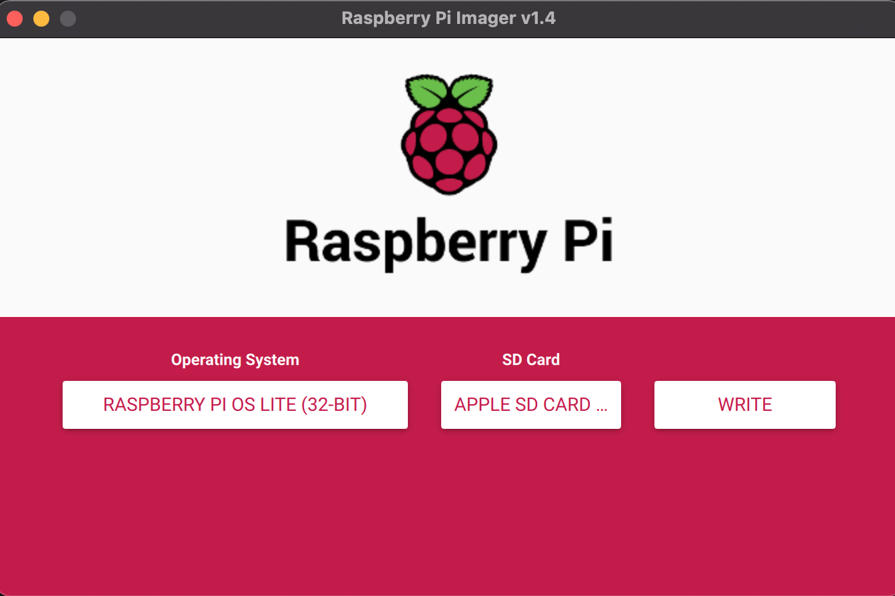
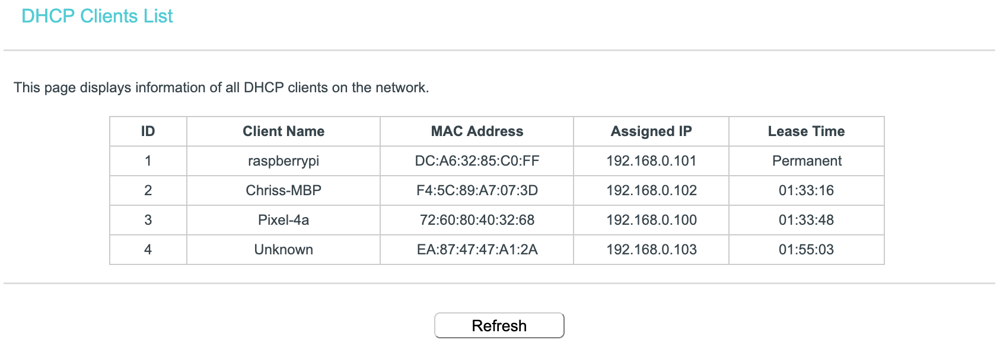
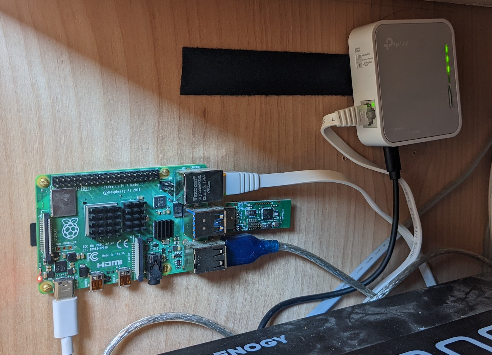

Before we can do anything else, we need to get the Raspberry Pi set up and running in the van. This includes finding a suitable power supply, installing the Raspberry Pi OS, setting the Pi up for remote access, and mounting the Pi in the van.

## What you'll need

- **[Raspberry Pi](https://amzn.to/4sDRFlU)** — I'm using the Raspberry Pi 4 with 4GB RAM. The Pi 3 should also work, but the 4 is recommended.
- **[USB Outlet](https://amzn.to/3OpCT43)** — Must be capable of delivering 3A at 5V. The USB-C output from this one works.
- **[USB Cable](https://amzn.to/4sAVxEf)** — Any USB-C cable should work.
- **[Micro SD Card](https://amzn.to/4vugovB)** — Ideally Application Class 2 (handles small I/O better). 32 GB or larger recommended.
- **[Router](https://amzn.to/4vwnwaW)** — I chose the TP-Link AC750 because it's cheap and has WiFi-as-WAN, letting me use my phone's hotspot or nearby WiFi for internet.
- **Laptop** — Any Windows/Mac/Linux machine with an SD card reader. If you don't have one, [a cheap USB adapter works fine](https://amzn.to/3Qo04wi).

## Step 1 — Flash Raspberry Pi OS

The first step is to install Raspberry Pi OS on the SD card. Use the Raspberry Pi Imager:

[https://www.raspberrypi.org/software/](https://www.raspberrypi.org/software/)

Install the imager on your laptop, insert the SD card, choose an operating system, select your SD card, and click **Write**. I'm using **Raspberry Pi OS Lite (32-bit)** because I want a headless setup — no monitor, keyboard, or mouse — accessed entirely via SSH.



## Step 2 — Enable SSH and configure WiFi

Once writing is complete, remove the SD card and re-insert it. You should see a new volume named `boot`. Navigate to it in your terminal:

```bash
cd /Volumes/boot
```

Create an empty file named `ssh` to enable SSH:

```bash
touch ssh
```

If you're connecting via ethernet you can skip this next part. To configure WiFi, create a `wpa_supplicant.conf` file:

```bash
nano wpa_supplicant.conf
```

Add the following, replacing the SSID and password with your network details:

```
ctrl_interface=DIR=/var/run/wpa_supplicant GROUP=netdev
update_config=1
country=US

network={
    ssid="NETWORK_SSID"
    psk="PASSWORD"
}
```

Save with `Ctrl-X`, `Y`, `Enter`.

## Step 3 — Boot the Pi and find its IP

The SD card is now ready. Eject it safely, install it in the Pi, and connect power. The Pi will boot and connect to your WiFi automatically.

To find the Pi's IP address, log into your router and look at the DHCP client list — you should see a device named `raspberrypi`. Use the router's address reservation feature to permanently assign it the same IP.



## Step 4 — SSH in and update

With the IP address in hand, SSH into the Pi from your terminal. The default password is `raspberry`:

```bash
ssh pi@192.168.0.101
```

If that works, you've successfully set up remote access! Change the default password:

```bash
passwd
```

Then update the software:

```bash
sudo apt-get update
sudo apt-get upgrade
```

## Mounting in the van

Since the Pi can now be fully accessed remotely, you can install it somewhere out of sight. Don't make it too inaccessible though — you'll eventually be connecting to the GPIO pins and USB ports for future projects. I screwed mine into the wall of my electronics cabinet near the van's power system since it's a central location.


