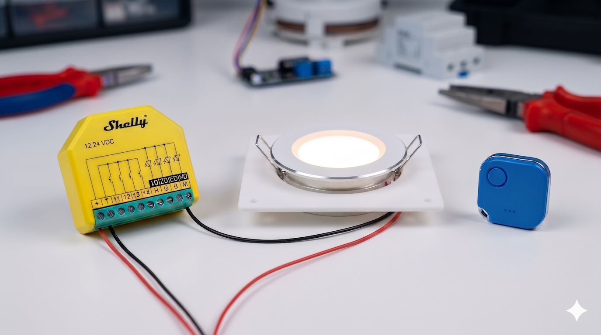
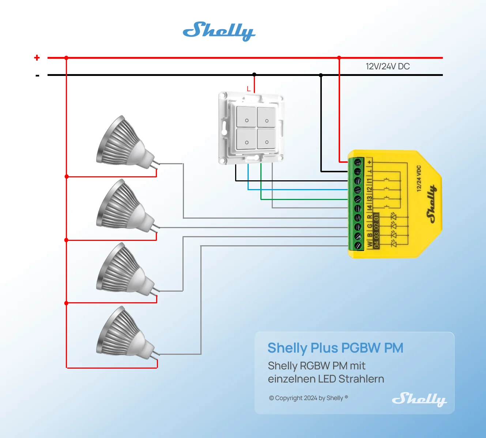
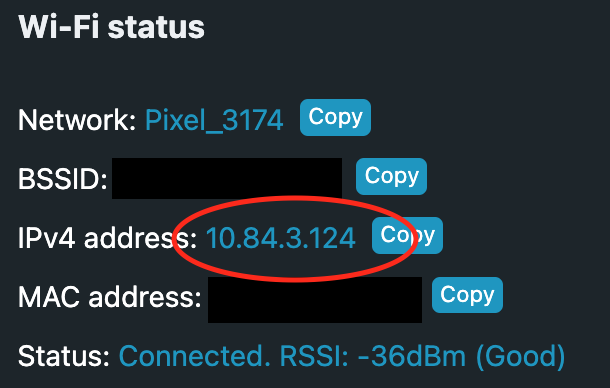
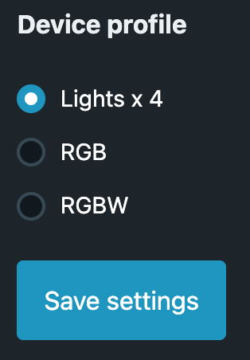
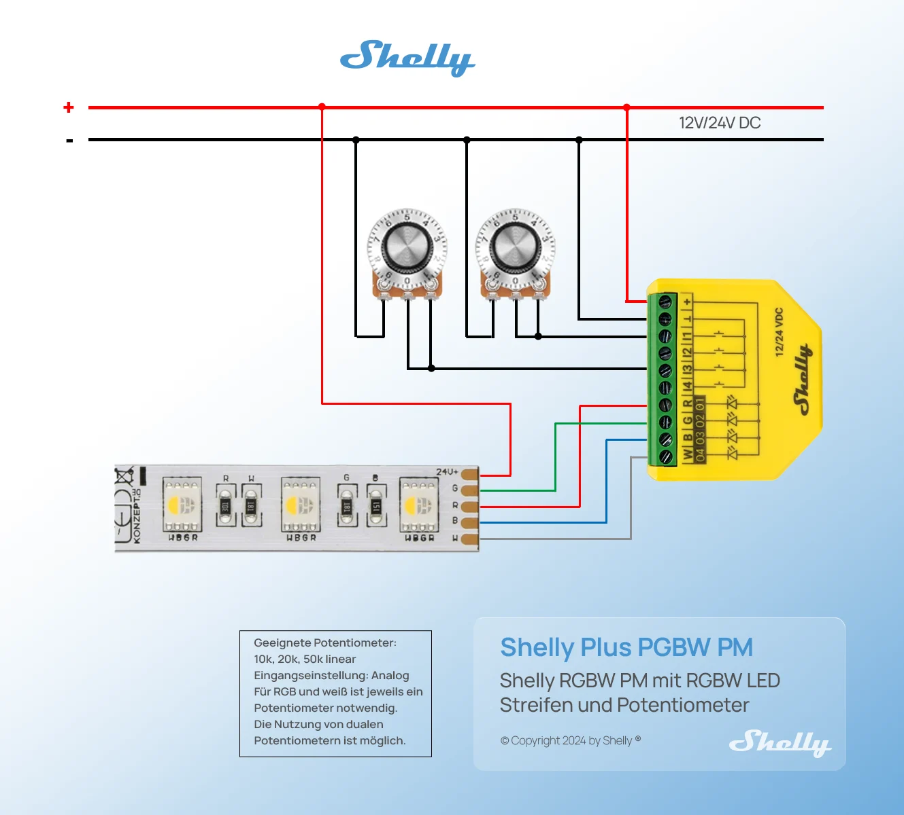
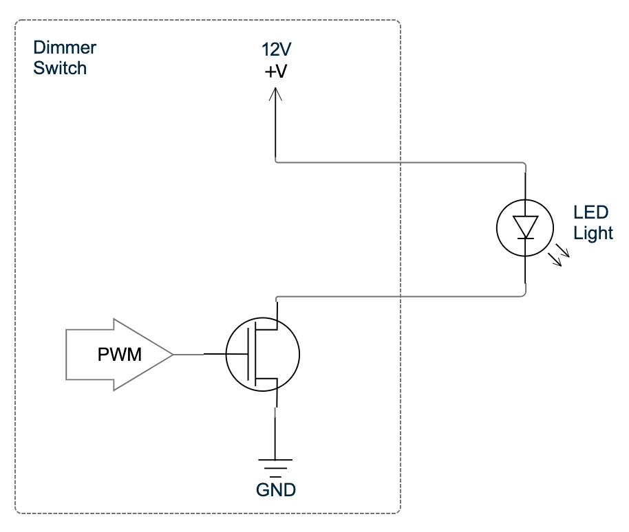
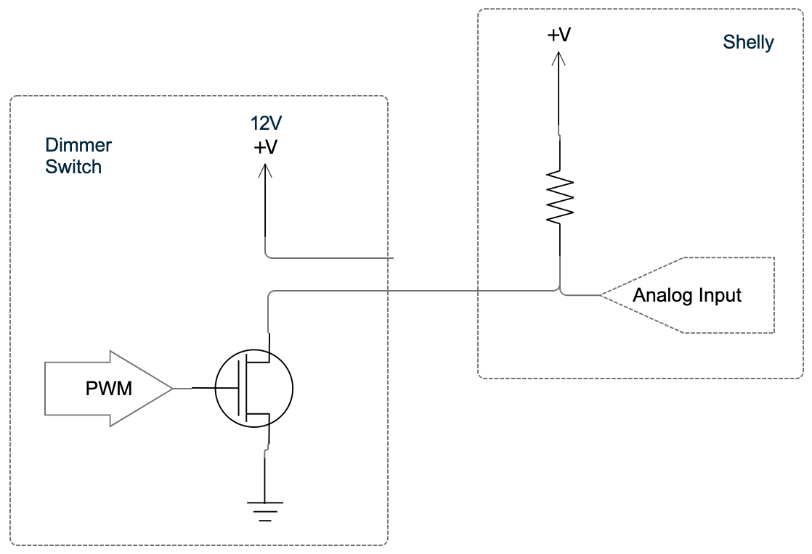
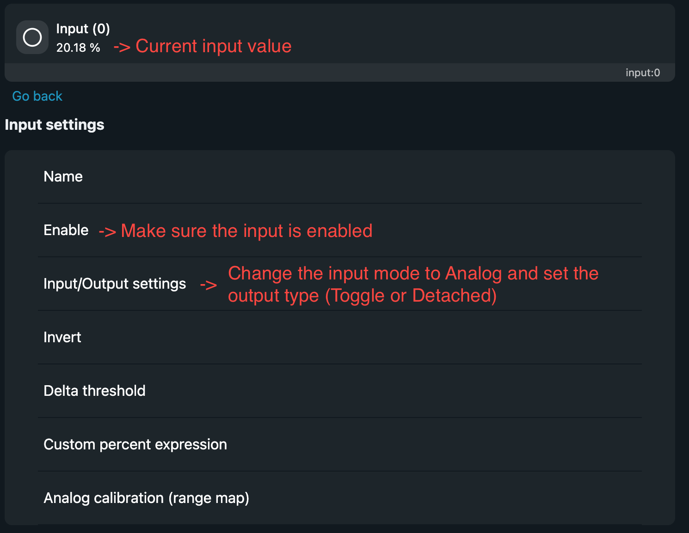

One of the largest issues I had with the old system was that the light control relied on too many other systems. There were many other components that could fail and cause the lights to not work which can be very frustrating! These included the Raspberry Pi running Home Assistant, the Zigbee dongle and Zigbee2MQTT service, the light controller, or even just the wifi network. Having remote control of the lights was also one of my favorite features of the smart system, so I wanted to set out to solve these problems.

[Original Smart Lights](https://van-automation.com/control_the_lights/)   
[Original Wireless Switches](https://van-automation.com/add_wireless_switches/)

My requirements were:
1) Be able to control the lights with remote switches
2) Have hard wired control from a switch that doesn't rely on any wireless signals
3) Have direct communication between the light controller and remote switches
4) Be able to also integrate into Home Assistant
5) Avoid any custom hardware for simplicity

## What you'll need

- **[Shelly Plus RGBW PM](https://amzn.to/4vGqBVW)** — This little device is great for controlling 12V or 24V lights. It has 4 channels for controlling single color lights, or a single channel for controlling RGBW lights. It also has 4 inputs that can be used for local hard wired control.
- **[Shelly BLU Button](https://amzn.to/48Zejhw)** — Battery-powered Bluetooth button that can communicate directly with the Shelly Plus RGBW PM. Also comes in a "tough" version.
- **[12V LED Lights](https://amzn.to/4sTrnfP)** — The lights I use in my van.
- **Wall Switch** - Many different options depending on the configuration you want. I'll go into this more later

## Light Wiring

> ⚠️ **Warning:** Disconnect all power before touching any wires



Follow the above diagram to wire up the lights. Connect your power wire (12V or 24V) to the **+** pin and ground wire to the **⊥** pin to power the Shelly. You can ignore the switch wiring for now, we'll go into that more later.

Connect the **+** side of your lights directly to 12V/24V power and the **-** side to one of the 4 channels on the Shelly labeled "R", "G", "B", or "W". Note this wiring is only for single color LED lights. You may connect more than one LED light in parallel to the same Shelly channel if you have multiple lights in a group that you want to control together, just note that each channel supports a maximum of 4A and 10A max for the whole device, so check the specification for your lights!

## Connect the Shelly to WiFi

Once the wiring is done and the power has been turned back on, it's time to set up the Shelly. The Shelly automatically starts up in Access Point mode with an SSID that starts with "ShellyPlusRGBWPM". Connect to this network, then in a web browser navigate to http://192.168.33.1/ to access the Shelly web interface.

If you have wifi in your van or a hotspot, you can connect the Shelly by going to Settings -> Wifi and entering your wifi details. Once the Shelly connects, you can see the IPv4 address in the Wi-Fi status section:



Copy this IP address, then you can disconnect from the Shelly network and reconnect to your wifi network. The same Shelly web interface should be accessible from that IP address you copied. If you want to ensure this IP address never changes, you can also set a static IP in the Shelly web interface.

## Configure the Shelly for your lights

The default configuration for the Shelly is for RGBW mode, so we need to reconfigure it for Lights x4 mode. Go to Settings -> Device Profile, select "Lights x 4" and click "Save settings"



Back on the home page, you should now see 4 lights corresponding to the 4 channels you wired up earlier with Light0 - R, Light1 - G, Light2 - B, and Light3 - W. Try using the controls in the web interface to control your lights and make sure they are fully working. If not, double-check your wiring.

There are some other settings you can configure now for your lights. Most settings are accessed by clicking on an individual light. These are the settings I adjusted:
- Transition duration: This changes the speed at which the lights turn on and off for a fading effect. I set this to 0.5 seconds
- Minimum brightness on toggle: If the brightness is below this value when you toggle your lights on, the brightness is automatically increased to this value. I set this to 100 so when I use the BLU buttons to toggle the lights later, they will always power on to 100% unless I specify otherwise
- High Frequency mode: If you notice a high-pitched ringing noise coming from your lights when they are on, you can try enabling High Frequency mode. This can be found in the general device settings, and increases the PWM frequency used by the shelly

## Configuring the BLU button for remote control

The newer generation Shelly devices support direct BLU button control out of the box, but they unfortunately don't make a 12V version yet. Luckily, the Shelly Plus RGBW PM has bluetooth and can support the BLU buttons through the use of scripts.

I wrote the following script for my BLU button:
[blue_button_control.js](https://github.com/CF209/Shelly-Scripts/blob/main/blu_button_control.js)

To use the script, first find the MAC address for your BLU button. This can easily be done with the [Shelly BLE Debug app](https://play.google.com/store/apps/details?id=cloud.shelly.bledebug&pcampaignid=web_share). Open the app, give it bluetooth permissions, then simply press your BLU button and it should appear in the app along with the MAC address. Copy this MAC address into BUTTON_MAC variable in the script here:
```javascript
// Replace with your BLU Button's MAC address (lowercase)
let BUTTON_MAC = "7c:c6:b6:9e:7b:42";
```

You can then add different light actions to the functions for each button press type as seen below. [See here for all the possible light functions](https://shelly-api-docs.shelly.cloud/gen2/ComponentsAndServices/Light/)

```javascript
// --- Define what each press type does ---

function singlePush() {
  // Toggle light channel 2
  Shelly.call("Light.Toggle", { id: 2 });
}

function doublePush() {
  // Toggle light channel 0
  Shelly.call("Light.Toggle", { id: 0 });
}

function triplePush() {
  // Turn off all lights
  Shelly.call("Light.SetAll", { on: false, transition_duration: 0.5 });
}

function longPush() {
  // Add your action here
}

function longHold() {
  // Dim all lights
  Shelly.call("Light.SetAll", { on: true, brightness: 1, transition_duration: 1 });
}
```

Before adding the script to the Shelly, make sure Bluetooth is enabled. From the web interface, go to Settings -> Bluetooth and enable it if it isn't already.

To add the script to the Shelly, go to the Scripts section in the web interface and click "Create script". Copy the full script code and click Save. Click start to run the script, and try pressing the button. The console at the bottom should show the button press, and your defined action should take effect.
```bash
BLE scanner started successfully
BLU Button press detected, type: 1
BLU Button press detected, type: 1
BLU Button press detected, type: 2
```

Back on the main Scripts page, enable "Run on startup" to make sure the script is always running, and it should be good to go!


## Control lights with Shelly app

Shelly also lets you control your devices through their app. Download the app here: [Shelly App](https://us.shelly.com/pages/shelly-app)

From the app click "Add device". If you're connected to the same wifi network as the Shelly, you can scan the local network, otherwise you can add via bluetooth. Follow the prompts to finish the setup. It may ask for your wifi info again if setting up via bluetooth.

After adding the device, it seems to automatically disable bluetooth for some reason. Be sure to re-enable this in the settings from the web interface or the app otherwise the BLU buttons will stop working.

## Control the lights with a PWM dimmer switch

The next step was to enable control from a hard wired switch so the light control wouldn't be fully reliant on wireless buttons. I already had this dimmer switch installed in my van, so I decided to see if I could make it work with the Shelly: [12-24V LED Dual Slide Switch and Dimmer](https://amzn.to/41Teebp)

The Shelly Plus RGBW PM has 4 input channels which can be set up connected to a switch, button, or be put in analog input mode. Simply connecting a switch or button is the easiest solution if you don't care about dimming, but I didn't want to lose the dimming function, so I set out to see if I could make use of the analog input mode.

The analog input mode is designed to be connected to a 10k potentiometer. It then has an internal pull-up resistor and uses a voltage divider connected to an ADC (Analog to Digital Converter) input on the microcontroller. The voltage read by the ADC can be used to determine the resistance of the potentiometer. The circuit looks something like this:


If you have a 10k potentiometer already, then I would just wire it up like shown here, but I still wanted to use my PWM dimmer switch.


The first step was to figure out how my dimmer switch works. I know it uses PWM, but it was unclear if the PWM was on the high 12V side, or on the low side. After some playing around with the switch and using my multimeter, I determined the circuit looks something like this:



The light power wire is always connected to 12V unless the switch is in the fully off position. The light ground wire is connected to ground through a MOSFET which switches on and off with the PWM signal to control the brightness.

With the above info, I thought that maybe I could connect the ground output from the dimmer switch directly to the Shelly's analog input. The PWM switching from the dimmer switch would ideally create an average voltage relative to the PWM duty cycle at the analog input which could be converted to brightness. Here is what the circuit would then look like:


Ideally I would also add a series resistor and a capacitor to the circuit to create a low pass filter for better averaging and to reduce any noise, but I didn't have any on hand in my van, so I just went with the direct connection and hoped for the best.

On the Shelly side, I needed to then configure the analog inputs. From the web interface home screen, select the input number that you wired the dimmer switch to. Make sure the input is enabled, then in the Input/Output settings select "Analog" for the input mode. If you leave the output type as "Toggle", whenever the analog input changes, it will automatically change the state of the light.



The initial results from this were mixed. The input values were relatively stable when they got close to 0% or 100%, but in the middle range there was a terrible amount of noise that would cause the brightness to jump all over the place. I could leave the dimmer switch in the same position, and the input value readings would jump as much as 25%. The Shelly input has the ability to set a Delta threshold to account for some noise, but with the large jumps, this wouldn't work for smooth dimming.

As a partial solution for now, I changed the input mode to "Detached" so that the Shelly wouldn't automatically change the light brightness from the input, then wrote a script to take the input and control the light. [The script can be found here](https://github.com/CF209/Shelly-Scripts/blob/main/pwm_input_handling.js) (note this script was written by AI) and does the following:
- At the extremes where the input appears to be stable (below 5% or above 95%), automatically set the light to 0% or 100% brightness respectively
- In between these values, it has the concept of a stability window where if the input stays in the same window for a certain number of readings, it considers it to be stable and locks the brightness at that level until the input reading leaves the stability window again. This prevents the light from continuously changing brightness from noise
- I also added a lookup table with preset brightness values for more gradual dimming since changes closer to 100% are much less noticeable than changes closer to 0%. This can be seen here:
```javascript
function mapBrightness(input) {
  if (input < 5.0)  return 0;
  if (input < 20.0) return 1;
  if (input < 40.0) return 10;
  if (input < 60.0) return 20;
  if (input < 80.0) return 35;
  if (input < 95.0) return 60;
  return 100;
}
```

In the end I'm still not very happy with this result as the dimming is still not very smooth and jumps around a bit while trying to dim, but it is workable. I'll most likely pick this back up again once I get back home and can easily add a low pass filter to the input. If that doesn't work, then I'll most likely move to a potentiometer design.